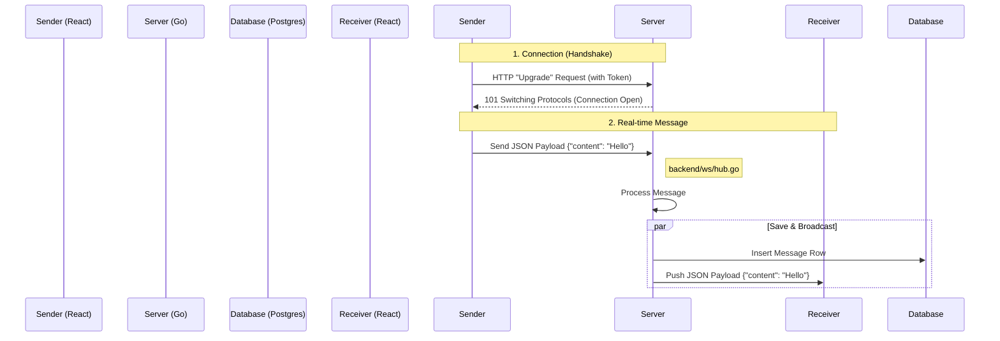

# Chat System Implementation Guide 📘

## 1. High-Level Architecture 🏗️

### The Mental Model
In a standard web app, we use **HTTP** (Request/Response). The client asks, the server answers, and they hang up.
In a **Chat App**, we use **WebSockets**. This is a persistent, full-duplex connection (like a phone call). The server can push data to the client *without* being asked.

### Communication Flow
1.  **Handshake**: Client sends an HTTP request to `/ws`. Server "upgrades" it to a WebSocket connection.
2.  **Persistent Connection**: The line stays open.
3.  **Real-Time Exchange**:
    -   **Sender** pushes a JSON message to Server.
    -   **Server (Hub)** determines who needs to receive it.
    -   **Server** pushes the JSON message to the **Receiver's** open socket.



---

## 2. Backend Implementation (Go) 🚂

### A. The Traffic Controller: `Hub` (`backend/ws/hub.go`)
The `Hub` manages all active connections. It doesn't deal with the network details, just the routing.

*   **`clients map[int][]*Client`**: The "Phonebook". Maps a User ID to a list of active connections (User might be on Phone + Laptop).
*   **`Broadcast` Channel**: The "Sorting Belt". Any message sent here gets routed to the correct recipient.

### B. The Messenger: `Client` (`backend/ws/client.go`)
Represents ONE active WebSocket connection.

*   **`ReadPump` (Goroutine 1)**: The "Ear".
    *   Listens to the WebSocket.
    *   Loops forever: `conn.ReadMessage()`.
    *   When a message arrives, sends it to the `Hub.Broadcast` channel.
*   **`WritePump` (Goroutine 2)**: The "Mouth".
    *   Listens to the `Send` channel (from the Hub).
    *   Loops forever.
    *   When the Hub sends a message here, it writes it to the WebSocket: `conn.WriteMessage()`.

> **Why two Goroutines?**
> Reading is blocking. Writing is blocking. If we did them in the same loop, we couldn't receive a message while we were waiting to send one (or vice versa). Go's concurrency makes this easy.

### C. The Handshake: `ChatController` (`backend/controller/chat_controller.go`)
Handles the initial HTTP request.

1.  **Auth**: Validates the JWT token from the query param (`/ws?token=xyz`).
2.  **Upgrade**: Uses `ws.Upgrader.Upgrade` to switch from HTTP to WebSocket.
3.  **Register**: Creates a new `Client` and registers it with the `Hub`.

---

## 3. Frontend Implementation (React) 🖥️

### A. The Brain: `ChatContext.tsx`
Manages the detailed logic so components don't have to.

*   **`useEffect` Connection Logic**:
    ```typescript
    useEffect(() => {
        // Connect
        ws.current = new WebSocket(url);
        
        // Handle Messages
        ws.current.onmessage = (event) => {
            const data = JSON.parse(event.data);
            setMessages(prev => [...prev, data]); // Functional update for fresh state
        };

        // Cleanup
        return () => ws.current.close();
    }, [token]);
    ```
    *   **Cleanup is crucial**: Prevents duplicate connections (memory leaks) when the component re-renders.

*   **Optimistic UI in `sendMessage`**:
    *   Ideally, we add the message to our own list *immediately* before the server confirms it, making the app feel instant.

### B. The Interface: `ChatWindow.tsx`
Renders the data.

*   **Auto-Scroll**:
    ```typescript
    useEffect(() => {
        messagesEndRef.current?.scrollIntoView({ behavior: 'smooth' });
    }, [messages]);
    ```
    *   Runs every time the `messages` array changes to keep the user at the bottom of the chat.

---

## 4. Key Concepts & Vocabulary 📚

| Concept | Explanation |
| :--- | :--- |
| **WebSocket** | A protocol for full-duplex (two-way) persistent communication. |
| **Handshake** | The initial HTTP request that establishes the WebSocket connection. |
| **Polling** | The old way: Client asks "New messages?" every 2 seconds. Inefficient. |
| **Goroutine** | A lightweight thread in Go. We use one for reading and one for writing per client. |
| **Channel** | Go's mechanism for communicating between Goroutines safely (Queue). |
| **Context API** | React's tool for sharing state (socket connection, messages) globally. |
| **Race Condition** | A bug where functionality depends on the timing of events (e.g., trying to send before the socket is open). |

---

## 5. Exercises for Mastery 🏋️

1.  **Message Sent Status**: Add a checkmark (`✓`) next to your own messages in `ChatWindow.tsx`.
2.  **Typing Indicator**:
    *   **Front**: Send `{type: "typing"}` on keypress.
    *   **Back**: Broadcast this event without saving to DB.
    *   **Front**: Listen and show "User is typing...".
3.  **Read Receipts**:
    *   Send `{type: "read"}` when opening a chat.
    *   Update the specific message's status in the DB and UI.
